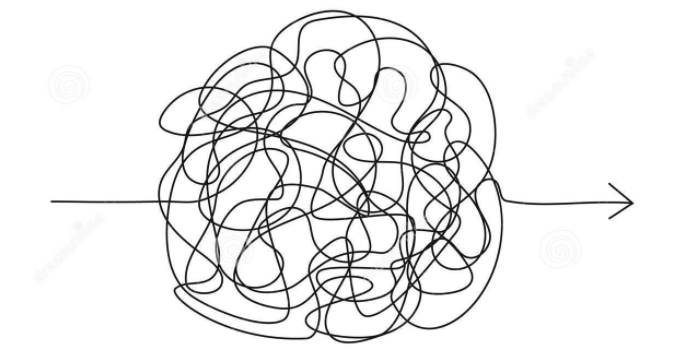

## The Research Process

### Hello, I'm Micah.

 

micah.saxton@tufts.edu

### The Research Process
1. Choose a topic
2. Conduct preliminary research
3. Develop a research question
4. Find and evaluate sources
5. Take strategic reading notes
6. Articulate a thesis
7. Organize reading notes into research notes

#### The research process is NOT linear

### 1. Choose a topic
What makes a good topic for research?

#### Examples?

### 2. Conduct preliminary research
Preliminary research will move you from an interesting topic to a relevant research question by providing background and context for your topic.

Reference sources such as encyclopedias, dictionaries, adn handbooks are excellent tools for this purpose.

Where do I find reference sources?

### 3. Develop a research question
A well-crafted research question will focus your research and keep you from information overload.

* I am researching... 
    * because I want to find out who/what/when/where/whether/why/how... 

#### Examples?

### 4. Find and evaluate sources

#### finding sources
* Take key words from your topic and research question and use those as search terms in JumboSearch
* Use the course guide
* Browse databases
* Schedule an appointment with your friendly neighborhood librarian :)

#### Evaluating sources

How do we know if a source is valuable?

* Who is the author or publisher?
    * For online sources check the "about" page and / or the source (.edu, .org, or .com)
* Is the source peer-reviewed?
* Is the source well documented?
* Is this the kind of source that should be in an academic paper.

### 6. Take strategic reading notes
The notes you take on each source will be guided by your research question.

* Always record complete bibliographic information for each source, remember [Zotero](https://www.zotero.org/)!
* Write down the author's thesis.
* Note, in your own words, the ideas from the source which are important in **answering your research question**.

### 7. Articulate a thesis
A thesis statement will be an answer to your research question. **Strong thesis statements make a claim that can be defended**.

#### Examples?

### 8. Organize your reading notes into research notes

Go through your reading notes and tag/label individual notes according to the themes or structure of your project. This will allow you to use your notes more efficiently when it comes to writing your paper.

"A thoughtful, judicious selection of material from your reading should be followed by a thoughtful, judicious selection from your own notes when the time comes to write." (Brundage, *Going to the Source*, 121)

### Bonus: Document your research process

[Sample research log](https://msaxton.notion.site/Sample-Research-Log-5d5743036c394ad184bab74eebf78acd)

### Remember, I'm here to help with this process.

 
micah.saxton@tufts.edu

### Bibliography
* Brundage, Anthony. *Going to the Sources: A Guide to Historical Research and Writing*. Hoboken: John Wiley & Sons, Incorporated, 2012.
* Booth, Wayne C. *The Craft of Research.* Fourth edition. Chicago: The University of Chicago Press, 2016.

